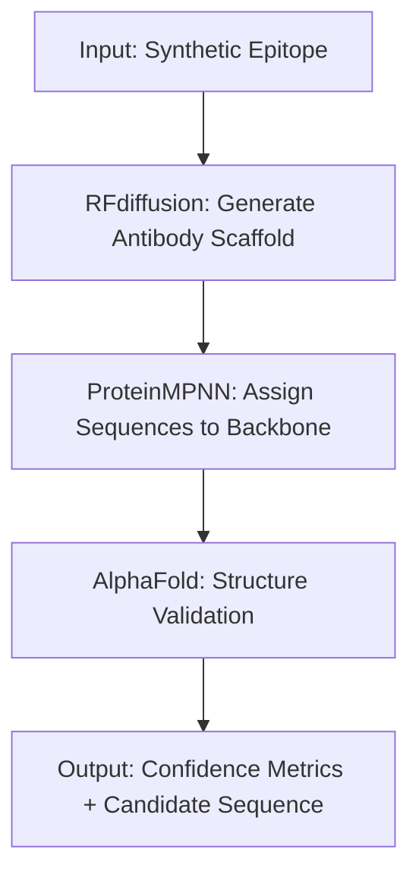

# Antibody Design Pipeline Overview

This document outlines the modular pipeline implemented in this project, simulating structure-based antibody design workflows aligned with RFdiffusion and ProteinMPNN.

---

## 🧬 Pipeline Overview



---

## 🔁 Step-by-Step Breakdown

### 1. RFdiffusion (Stub)
**Goal:** Generate candidate backbones (e.g., CDR loop structure) from an epitope.
- Uses a placeholder script `run_rf_antibody.sh`
- Produces `output/rfdiffusion/scaffold.pdb`

### 2. ProteinMPNN (Stub)
**Goal:** Assign amino acid sequences to the generated backbone.
- Uses `run_proteinmpnn.sh`
- Produces `output/proteinmpnn/seq.fasta`

### 3. AlphaFold Validation (Stub)
**Goal:** Validate designed sequences for structural plausibility.
- Uses `run_af2_validation.py`
- Prints mock RMSD/pLDDT/pAE metrics

---

## 🧠 Inspired by

- [RFdiffusion GitHub Issue #320](https://github.com/RosettaCommons/RFdiffusion/issues/320) — Conditional design of antibody scaffolds.
- [Karatt-Vellatt et al., 2025](https://www.researchgate.net/publication/391977499) — Use of structure-based models in therapeutic antibody workflows.

---

## 🔍 Output Folder Structure

```
output/
├── rfdiffusion/
│   └── scaffold.pdb
├── proteinmpnn/
│   └── seq.fasta
```

---
